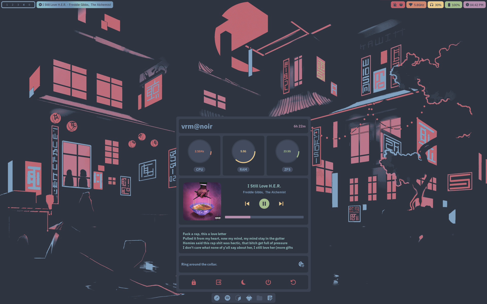
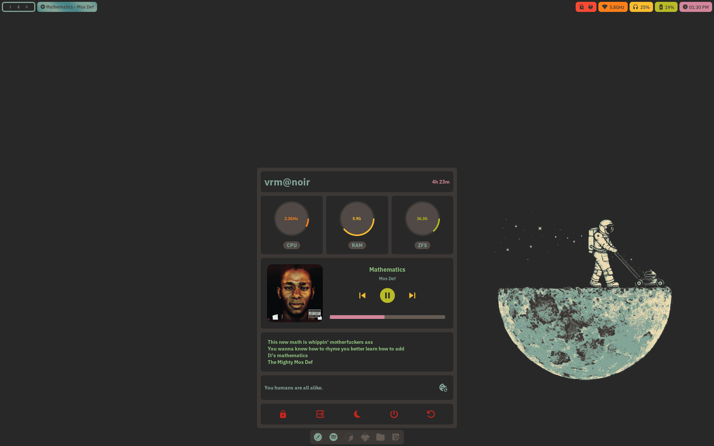

# colors

Personal colorscheme flake.

# Usage

The colors scheme is exposed via `lib.colors`.

The `nixosModules.colors` also exposes it to `config.colors`.

# Nord

Branch: `master` `nord`

# Gruvbox

Branch: `gruvbox`

